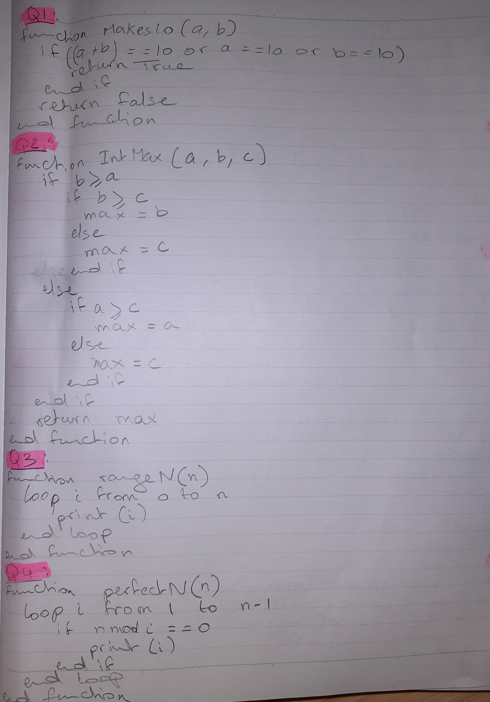

# Quizzes Task 
## All pseudo-codes solved
 <br>
 <br>
 <br>
### Quiz 1
```py
# Code definition of function
def Makes10(a, b):
    if a+b==10 or a==10 or b==10:
        return True
    return False
# Tests
print(Makes10(9, 10))
print(Makes10(9, 9))
print(Makes10(1, 9))
```
 <br>
 <br>
### Quiz 2
```py
# Code definition of function
def IntMax(a, b, c):
    if b>=a:
        if b>=c:
            max=b
        else:
            max=c
    else:
        if a>=c:
            max=a
        else:
            max=c
    return max
# Tests
print(IntMax(1, 2, 3))
print(IntMax(1, 3, 2))
print(IntMax(3, 2, 1))
```
 <br>
 <br>
### Quiz 3
```py
# Code definition of function
def rangeN(n):
    for i in range(0, n+1):
        print(i)
# Tests
rangeN(6)
```
 <br>
 <br>
### Quiz 4
```py
# Code definition of function
def perfectN(n):
    for i in range(1, n-1):
        if n%i==0:
            print(i)
# Tests
perfectN(6)
```
 <br>
 <br>
### Quiz 5 
```py
# Code definition of function
def tableM(x):
    for i in range(1, 10):
        print(x,"x",i,"=",x*i)
# Tests
tableM(2)
```
 <br>
 <br>
### Quiz 6
```py
# Code definition of function
def MixStart(str):
    if str[1]=="i" and str[2]=="x":
        return True
    return False
# Tests
print(MixStart('mix snacks'))
print(MixStart('pix snacks'))
print(MixStart('piz snacks'))
```
 <br>
 <br>
### Quiz 7
```py
# Code definition of function
def letters(x):
    for i in range(0, len(x)+1):
        print(i,'->',x[i])
# Tests
letters('hello')
```
 <br>
 <br>
### Quiz 8
```py
# Code definition of function
def maxAbs(numbers):
    max=0
    for i in range(0, len(numbers)):
        if abs(numbers[i])>max:
            max=abs(numbers[i])
    print("max absolute is ", max)
# Tests
maxAbs([-4, 5, 6, -7])
maxAbs([-1, 0, 1])
maxAbs([-100, 0, 3,-200])
```
 <br>
 <br>
### Quiz 9
```py
# Code definition of function
def missingNumber(x):
    for i in range(0, len(x)-1):
        if x[i]!=x[i+1]-1:
            print(x[i]+1)
# Tests
missingNumber([1, 2, 3, 5, 6, 7])
missingNumber([4, 5, 6, 8, 9, 10])
missingNumber([73, 74, 75, 76, 78, 79])
```
 <br>
 <br>
### Quiz 10
```py
# Code definition of function
def BigNeighbour(x):
    difference=0
    difference_max=0
    for i in range(0, len(x)-1):
        difference=abs(x[i+1]-x[i])
        if difference>difference_max:
            difference_max=difference
    return difference_max
# Tests
print(BigNeighbour([1, 2, 3, 5, 6, 7])) 
print(BigNeighbour([0, 5, 6, 10]))
print(BigNeighbour([73, 74, 174, 76, 78, 79]))
```
 <br>
 <br>
### Quiz 11
```py
# Code definition of function
def SameFirstLast(x):
    if len(x)>=1 and x[0]==x[-1]:
        return True
    return False
# Tests
print(SameFirstLast([1, 2, 3]))
print(SameFirstLast([1, 2, 3, 1]))
print(SameFirstLast([1, 2, 1]))
```
 <br>
 <br>
### Quiz 12
```py
# Code definition of function
def wordlength(s):
    sum=0
    for i in range(0, len(s)):
        sum+=len(s[i])
    return (sum, len(s))
# Tests
print(wordlength(["home", "car", "travel", "beach"]))
print(wordlength(["sun","sat","cut","can"]))
print(wordlength(["police", "abacus"]))
```
 <br>
 <br>

