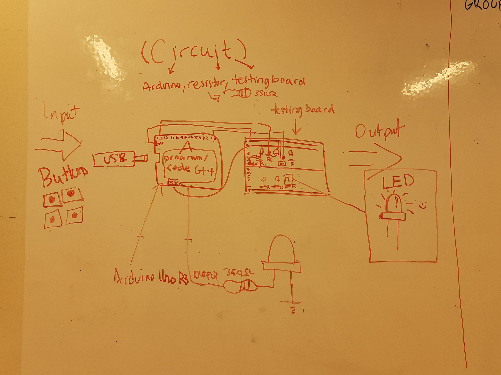
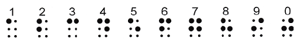
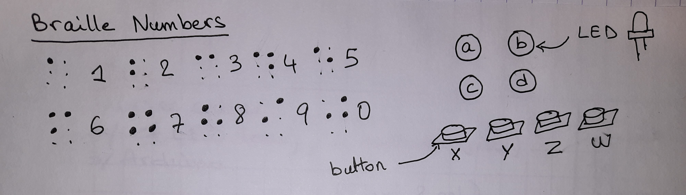
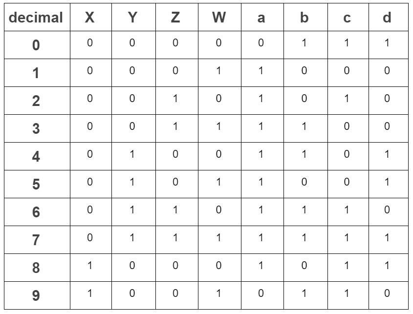

# UNIT 2 - Salma Bhar
# Braille Counting Project
## Criteria A: Planning
### Context of the problem
This project is a program to count from 0 to 9. The preceding has been done last year with the current G12s who used the standard 7 figures to count. Therefore, this year's G11s will have to think outside the box and come up with more creative ways to create a program with the purpose of counting while using the same criteria and resources. We will dispose of:  
- 7 LEDs  
- 4 Buttons  
- Arduino  
- Circuits components  

### Justification of the solution
I will create a program dsiplayed on LEDs which counts from 0 to 9 in braille language when we press different combinations of buttons. As for hardware, I am using 4 LEDs, 4 buttons and an Arduino. It is worth noting that only 4 LEDs will be used out of the 7 provided which optimizes this solution even further. Moreover, I will be using C++ as a software language since it is the primary coding language for the Arduino and we have had practise sessions during class in that language. In fact in 2017, C++ ranked 4th among 24 other programming languages in September [1] due to its fast processing and several built-in functions. The program will be first run on the simulator Tinkercad to avoid damaging the physical components when testing the solution.  

[1] Ramasubramanian, Sowmya. “C++ Is Now the Fastest-Growing Programming Language, Report Says.” The Hindu, The Hindu, 11 Sept. 2020, www.thehindu.com/sci-tech/technology/c-is-now-the-fastest-growing-programming-language/article32580426.ece. 

T.E.L.O.S. Study:  
T-Technical-Is the project technically possible? We dispose of a computer, Arduino
E-Economic-
L-Legal-
O-Operational-
S-Scheduling-
### Criteria for success
1. There are no bugs in the program  
2. Provides clear signage of the counting  
3. Full Documentation on GitHub  

## Criteria B: Design
### System Diagram
We drew the following system diagram in class:  
  
### Initial Sketches
These are braille numbers:
  
I drew the initial idea of the system in a sketch:
  
## Criteria C: Devolepment
I started with a truth table of the 4 LEDs: a, b, c, d.
  
Then I traced the K-maps of each of the 4 LEDs.
  
## Criteria D: Functionality
## Criteria E: Evaluation
