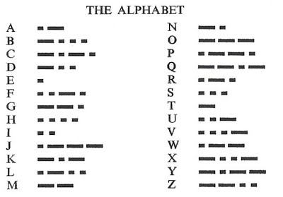

## Criteria A: Planning
### Context of the problem
This project is a program to communicate between the earth and the moon in signals. Focusing on the earth's side sending messages to the moon's side, our program inputs English text on an LCD and outputs messages in Morse Code using an LED. We will dispose of: <br>
- 1 LED <br>
- 2 Buttons <br>
- Arduino <br>
- Circuits components <br>
- 1 LCD <br>

### Justification of the solution
We will create a program dsiplayed on 1 LED and 1 LCD which gets inputs by pressing 2 buttons. As for hardware, we are using 1 LED, 1 LCD, 2 buttons and an Arduino. The product enables us to input messages in English using the right button to cycle through the English alphabet and 2 commands "SEND" and "DELETE". The left button enables us to select letters or commands. The message, then, is converted into Morse Code which is displayed through an LED. Moreover, we will be using C++ as a software language since it is the primary coding language for the Arduino and we have had practise sessions during class in that language. In fact in 2017, C++ ranked 4th among 24 other programming languages in September [1] due to its fast processing and several built-in functions. The program will be first run on the simulator Tinkercad to avoid damaging the physical components when testing the solution and thus reduce the costs of this project [2]. <br>

[1] Ramasubramanian, Sowmya. “C++ Is Now the Fastest-Growing Programming Language, Report Says.” The Hindu, The Hindu, 11 Sept. 2020, www.thehindu.com/sci-tech/technology/c-is-now-the-fastest-growing-programming-language/article32580426.ece.  <br>
[2] TinkerCAD Review: Pricing, Pros, Cons &amp; Features. (2020, May 14). Retrieved January 10, 2021, from https://comparecamp.com/tinkercad-review-pricing-pros-cons-features/#:~:text=The%20main%20benefits%20of%20TinkerCAD,%2C%20and%20user%2Dfriendly%20interface.&amp;text=TinkerCAD%20allows%20businesses%20to%20produce,to%20pay%20for%20large%20warehouses.

T.E.L.O.S. Study: <br>
T-Technical-Is the project technically possible? We dispose of a computer, Arduino, TinkerCat simulator, Arduino IDE for C++ code and circuits components. All technical necessities for this project are satisfied. <br>
E-Economic- Can the project be afforded? Will it increase profit? This project is developed for free by UWC ISAK Japan students. Thanks to the funding provided to our school, we can afford all of the components necessary for the project. We also have a budget of 1 trillion moons according to our client. <br>
L-Legal- Is the project legal? The project is completely legal as the 1947 Japanese constitution does not criminalize small digital projects like ours. <br>
O-Operational- How will the current operations support the change? The project will operate on computers and Arduino. The process does not have any errors and is perfectly operational. <br>
S-Scheduling- Can the project be done in time? We are given 3 weeks to complete this project and the tasks have been regularly distributed to assure that it is completed by Friday, December 18th, 2020. <br>
### Criteria for success
1. The product allows the user to enter messages in English and send messages in Morse Code. <br>
2. The product contains all the alphabet. <br>
3. The product contains special commands like send and delete. <br>
4. The display uses maximum 1 LED, 1 LCD and 2 buttons. <br>
## Criteria B: Design
### Test Plan 
|                                       Test                                       |                                                           Expected Outcome                                                           | Met? |
|:--------------------------------------------------------------------------------:|:------------------------------------------------------------------------------------------------------------------------------------:|:----:|
| Crit.1. The product allows the user to enter messages in English and send messages in Morse Code.               | When we enter a message "hello" in English through the buttons, we should be able to see it written on the LCD. When the command "send" is pressed, the LED should signal the same message "hello" in Morse Code.                                                              | YES  |
| Crit.2. The product contains all the alphabet.               | Going through the list of options, we can see the complete English alphabet on the LCD.                                                              | YES  |
| Crit.3. The product contains special commands like send and delete. | Going through the list of options, we can see and select the commands "send" and "delete" on the LCD.                                                       | YES  |
| Crit.4. The display uses maximum 1 LED, 1 LCD and 2 buttons.                   | Counting the LEDs and buttons shown, there should be max 1 LED, 1 LCD and 2 buttons.                                                        | YES  |
### System Diagram
We drew the following system diagram in class: <br>
 <br>
**Fig. 1:** System Diagram of the project <br>
### Initial Sketches
This is the English alphabet in Morse Code: <br>
 <br>
**Fig. 2:** Reference for th Morse Alphabet <br>
I drew the initial idea of the system in a sketch: <br>
 <br>
**Fig. 3:** Diagram showing a sketch of the design of the Earth-Moon communication and mapping of the relationship between the buttons and LCD/LED <br>
This is the usage guide for the project <br>
 <br>
**Fig. 4:** $$$$
## Criteria C: Development
I started by making the following questionnaire through Google Form and sent it to our client for answers. I received the following answers: <br>
 <br>
**Fig. 5:** Salma's Questionnaire for the customer for product to communicate from the Moon to Earth (English to Binary) <br>
Link to the form: https://docs.google.com/forms/d/1H1WiqExpZST-eg7Mu7m7e60cFBCgCfaeQDJP1KTEokk/edit <br>
  <br>
Then, I got teamed up with my classmates Kazu and Zoe to develop the project together. However, I noticed that my personal questionnaire was originally based on my personal project which consisted in the communication from the Moon to Earth i.e. English to Binary (see Fig. 5). Whereas when I teamed up with my classmates, our collective project consisted on the communication from Earth to the Moon i.e. English to Morse. Therefore, I had to base my project on Zoe's questionnaire, while keeping my personal form since it is still partly relevant, presented in the following Google Form. She received the following responses: <br>
 <br>
**Fig. 6:** Zoe's Questionnaire for the customer for product to communicate from Earth to the Moon (English to Morse) <br>
Link to the form: https://docs.google.com/forms/d/1sAb2MSjLs3s9Ns5FiN_-gnkdA2HU1GSUKQgszn56wIU/edit?ts=5ff2f5a5&gxids=7628 <br>
  <br>
Once we received the answered form, we also conducted one brief face-to-face interview with the customer for further inquiries about the product. <br>
  <br>
This is the C++ code for the Arduino: <br>
```cpp
// include the library code:
#include <LiquidCrystal.h>
int index = 0; 
// add all the letters and digits to the keyboard
String keyboard[]={"SEND", "DEL","A", "B", "C", "D","E","F","G","H","I","J","K","L","M","N","O","P","Q","R","S","T","U","V","W","X","Y","Z"};
String text = "";
int numOptions = 28;

// definitions of components
int led=10;
int btn_right=2;
int btn_left=3;
  
// initialize the library with the numbers of the interface pins
LiquidCrystal lcd(12, 11, 5, 4, 9, 8);

void setup() {
  // set up the LCD's number of columns and rows:
  lcd.begin(16, 2);
  Serial.begin(9600);
  // Print a message to the LCD.

  // These two commands create interruptions for the buttons.
  // Interruptions are a way of telling the arduino to pay 
  // attention to specific events, in this case the buttons
  attachInterrupt(0, changeLetter, RISING);//button A in port 2
  attachInterrupt(1, selected, RISING);//button B in port 3
  pinMode(13, OUTPUT);
}

void loop() {
  // set the cursor to column 0, line 1
  // (note: line 1 is the second row, since counting begins with 0):
  lcd.clear();
  lcd.setCursor(0, 0);
  lcd.print(keyboard[index]);
  lcd.setCursor(0, 1);
  lcd.print(text);
  delay(100);
}

//This function changes the letter in the keyboard
void changeLetter(){
 	index++;
//check for the max row number
	if(index==numOptions){
		index=0; //loop back to first row
	} 
}

//this function adds the letter to the text or send the msg
void selected(){
  String key = keyboard[index];
  if (key == "DEL")
  {
      int len = text.length();
      text.remove(len-1);
  }
  else if(key == "SEND")
  {
      En2Morse();
  }
  else{
      text += key;
  }
      index = 0; //restart the index

}

void dash(){
  	Serial.println("sending a dash");
	digitalWrite(led, HIGH);
    Serial.println("led on");
	delay(2000);
    digitalWrite(led, LOW);
    Serial.println("led off");
	delay(2000);
}

// definition of the dash and dot functions for the Morse Language
void dot(){
    Serial.println("sending a dot");
	digitalWrite(led, HIGH);
    Serial.println("led on");
	delay(1500);
	digitalWrite(led, LOW);
    Serial.println("led off");
	delay(1500);
}

// equivalent of the English alphabet in Morse Code
void En2Morse(){
  Serial.print(text);
  for(int i=0; i<text.length(); i++){
    if(text[i]=='A'){
    dot();
    dash();}    
    else if(text[i]=='B'){
    dash();
    dot();
    dot();
    dot();}
    else if(text[i]=='C'){
    dot();
    dot();
    dot();}
    else if(text[i]=='D'){
    dash();
    dot();
    dot();}
    else if(text[i]=='E'){
    dot();}
    else if(text[i]=='F'){
    dot();
    dash();
    dot();}
    else if(text[i]=='G'){
    dash();
    dash();
    dot();}
    else if(text[i]=='H'){
    dot();
    dot();
    dot();
    dot();}
    else if(text[i]=='I'){
    dot();
    dot();}
    else if(text[i]=='J'){
    dash();
    dot();
    dash();
    dot();}
    else if(text[i]=='K'){
    dash();
    dot();
    dash();}
    else if(text[i]=='L'){
    dot();
    dash();
    dot();
    dot();}
    else if(text[i]=='M'){
    dash();
    dash();}
    else if(text[i]=='N'){
    dash();
    dot();}
    else if(text[i]=='O'){
    dash();
    dash();
    dash();}
    else if(text[i]=='P'){
    dot();
    dash();
    dash();
    dot();}
    else if(text[i]=='Q'){
    dash();
    dash();
    dot();
    dash();}
    else if(text[i]=='R'){
    dot();
    dash();
    dot();}
    else if(text[i]=='S'){
    dot();
    dot();
    dot();}
    else if(text[i]=='T'){
    dash();}
    else if(text[i]=='U'){
    dot();
    dot();
    dash();}
    else if(text[i]=='V'){
    dot();
    dot();
    dot();
    dash();}
    else if(text[i]=='W'){
    dot();
    dash();
    dash();}
    else if(text[i]=='X'){
    dash();
    dot();
    dot();
    dash();}
    else if(text[i]=='Y'){
    dash();
    dot();
    dash();
    dash();}
    else if(text[i]=='Z'){
    dash();
    dash();
    dot();
    dot();}
  }  
}
```
The project is simulated on TinkerCat as follows: <br>
 <br>
**Fig. 7:** Diagram of the simulation on TinkerCat of the project <br>
Using the equipment given to us in class, our team assembled the circuit as below: <br>
 <br>
**Fig. 8:** Picture of the project assembled
## Criteria D: Functionality
This video shows the user entering the text "HEGI" in English through the 2 buttons. After pressing "send", the message is shown through signals on the green LED: <br>
https://youtu.be/3gf0I4hQ17o
## Criteria E: Evaluation


